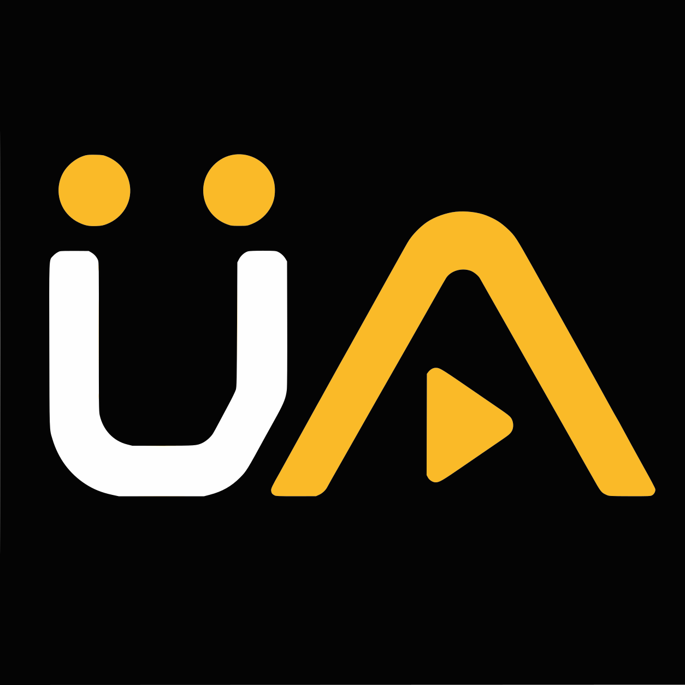

# UmlautAdaptarrEX - Unraid Community Applications Template

  

This repository holds the Unraid [Community Applications](https://forums.unraid.net/topic/38582-plug-in-community-applications/) template for **[UmlautAdaptarrEX](https://github.com/xpsony/UmlautAdaptarrEX)** - a full Next.js + Fastify + Prisma rewrite of the legacy .NET UmlautAdaptarr.

UmlautAdaptarrEX is an umlaut / German-title proxy that sits between your *Arr stack (Sonarr, Radarr, Lidarr, Readarr, Prowlarr) and your indexers, normalizing German titles so releases that would otherwise be missed get matched correctly. It ships a built-in Web UI for setup, monitoring and live log streaming, and persists everything in a single SQLite file under `/data`.

## Install via Community Applications

1. Install the [Community Applications](https://forums.unraid.net/topic/38582-plug-in-community-applications/) plugin if you don't have it yet.
2. Open **Apps** in the Unraid web UI and search for `UmlautAdaptarrEX`.
3. Click **Install**, review the defaults (ports, appdata path, `PUID`/`PGID`, `TZ`) and apply.
4. Once the container is healthy, open `http://<unraid-ip>:5007/setup` and follow the wizard.

## Ports

| Port | Purpose                                                                                                |
| ---- | ------------------------------------------------------------------------------------------------------ |
| 5005 | Fastify API + WebSocket logs - this is the URL you point your *Arr instances at                  |
| 5006 | TCP HTTP-CONNECT proxy for Prowlarr indexers                                                            |
| 5007 | Next.js Web UI (setup wizard, admin panel, live log stream)                                            |

## Files in this repository

- [`ca_profile.xml`](ca_profile.xml) - repository overview and metadata shown in Community Apps.
- [`templates/umlautadaptarrex.xml`](templates/umlautadaptarrex.xml) - the Docker app template consumed by Unraid.
- [`icon.svg`](icon.svg) - the icon referenced by the CA profile and the template.
- [`LICENSE`](LICENSE) - MIT license.

## Support

- Bug reports & feature requests: [GitHub Issues](https://github.com/xpsony/UmlautAdaptarrEX/issues)
- Chat: [Discord](https://discord.gg/src6zcH4rr)

## License

MIT - see [LICENSE](LICENSE).
